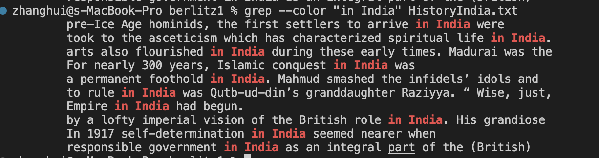

## Commands I choose: ```grep```
The first interesting command option for ```grep``` is ```ls |grep ```. The command is used to find all of the files in the directory that contain the string in its name. 
### Example1:
```
# code block
zhanghui@s-MacBook-Pro berlitz2 % ls |grep Algarve
Algarve-History.txt
Algarve-Intro.txt
Algarve-WhatToDo.txt
Algarve-WhereToGo.txt
```
I change the directory in to berlitz2 and use ```ls |grep Algarve ```to find all the text file that has contains ```Algarve ```in its name. It can be useful if you want to find the txt files while forgetting about its full name. 

### Example2:
```
# code block
zhanghui@s-MacBook-Pro berlitz2 % ls |grep ToDo
Algarve-WhatToDo.txt
Amsterdam-WhatToDo.txt
Athens-WhatToDo.txt
Bahamas-WhatToDo.txt
Bali-WhatToDo.txt
Barcelona-WhatToDo.txt
Beijing-WhatToDo.txt
Berlin-WhatToDo.txt
Bermuda-WhatToDo.txt
Budapest-WhatToDo.txt
California-WhatToDo.txt
CanaryIslands-WhatToDo.txt
Cancun-WhatToDo.txt
China-WhatToDo.txt
Costa-WhatToDo.txt
CostaBlanca-WhatToDo.txt
Crete-WhatToDo.txt
Cuba-WhatToDo.txt
Nepal-WhatToDo.txt
Paris-WhatToDo.txt
Poland-WhatToDo.txt
Portugal-WhatToDo.txt
PuertoRico-WhatToDo.txt
Vallarta-WhatToDo.txt
```
In this example, I found all of the text file in the directy ```berlitz2 ``` that contains the ```ToDo ```. It would take lots of time if we manually look through the files in the directory to look for certain file with ```ToDo ```in its name, while this command shows us the output in seconds. 

Another command I found interesting is the ```ls |grep -v```. This command can filter out any txt file whose name contains the given string
### Example1:
```
# code block
zhanghui@s-MacBook-Pro berlitz2 % ls |grep -v To  
Algarve-History.txt
Algarve-Intro.txt
Amsterdam-History.txt
Amsterdam-Intro.txt
Athens-History.txt
Athens-Intro.txt
Bahamas-History.txt
Bahamas-Intro.txt
Bali-History.txt
Barcelona-History.txt
Beijing-History.txt
Berlin-History.txt
Bermuda-history.txt
Budapest-History.txt
Budapest-WhereoGo.txt
California-History.txt
Canada-History.txt
CanaryIslands-History.txt
Cancun-History.txt
China-History.txt
Costa-History.txt
CostaBlanca-History.txt
Crete-History.txt
Cuba-History.txt
Nepal-History.txt
NewOrleans-History.txt
Poland-History.txt
Portugal-History.txt
PuertoRico-History.txt
Vallarta-History.txt
```
In this example, I filtered out any file in ```berlitz2 ```whose name contains the string ```To ```. As a result, the output is the list of file whose name does not contain ```To ```, which saves us a lot of time if we want some files with specific names. 

### Example2
```
# code block
zhanghui@s-MacBook-Pro OUP % ls  |grep -v ch 
Abernathy
Berk
Castro
Kauffman
Rybczynski
```
In this example, I searched all directories in the directory ```OUP ``` whose name does not contain ```ch ```. With```-v ```, I am able to go through every directory in the ```OUP ``` and find all directories that meet certain requirement. 


The third command that I felt very interested in is the ```grep -n <<string>> <<filename>> ```. The command can be used to show the number of the lines in the file that contain the given string and also print out the line with the word. 

### Example1:
```
# code block
zhanghui@s-MacBook-Pro Berk % grep -n "century" CH4.txt
32:Among influential explanations of why preschoolers are so drawn to pretending, Freud’s psychoanalytic theory and Piaget’s cognitive theory held sway for much of the twentieth century. Although each has made valuable contributions to our understanding, a new, more powerful view of the meaning of young children’s play has arrived on the scene, thanks to Vygotsky’s sociocultural theory.
240:As play theorist Brian Sutton-Smith pointed out more than a quarter-century ago, make-believe enables children who are still acquiring language to represent their everyday lives and inner thoughts and feelings more completely than is possible through any other symbolic means. This confirms Vygotsky’s statement that “in play, the child always behaves beyond his average age, above his daily behavior.” Look back at the vignettes described in this chapter—of Sophie giving a sleepy teddy bear a pacifier, of Alison recalling the train crash in India, of Emily traveling to Sea World, and of Traci role-playing a mother getting sick and dying—and note how difficult it would be for 2- to 4-year-olds to construct such well-articulated ideas only in words or in their drawings. Consequently, adults do not need to “tutor” preschoolers in pretending, as they sometimes do when helping them master puzzles or other similar tasks.
```
In this example, I searched for the string ```century ``` in the ```CH4.txt ```. It is useful because the command showed the number of the line the string is at and also the print out the line containing the string. It can help us to immediately locate specific strings in the given file. 

### Example2:
```
# code block
zhanghui@s-MacBook-Pro berlitz1 % grep -n "history" HistoryIndia.txt
720:        history, self-sufficiency in food production. Old entrenched
zhanghui@s-MacBook-Pro berlitz1 % grep -n "has" HistoryIndia.txt
7:        India has always been a melange of peoples. Apart from some
61:        took to the asceticism which has characterized spiritual life in India.
170:        chased out again.
262:        in Bengal and the Deccan. The end was hastened by a man who made other
373:        the north. The most significant resistance came from Marathas, in
377:        Starting out from Pune, Shivaji’s Marathas fought off the
381:        crowned King of the Marathas and, to pay his soldiers, plundered the
400:        ways. The Sikhs reacted violently to persecution, and the Marathas
439:        Marathas, whose clans controlled the puppet Mughal emperor in Delhi and
446:        Delhi from the Marathas, or Assam from Burma — the British annexed it
695:        Indian troops flown in when the maharaja hastily acceded to India.
697:        plebiscite — which has never been held. An invasion by Pakistan in 1965
698:        was aborted and has left the issue distinctly moot.
708:        last wishes, uttering prayers and crying: “Panditji has become
711:        of Lal Bahadur Shastri, Indira Gandhi proved strong enough in her own
zhanghui@s-MacBook-Pro berlitz1 % 

```
The example is followed by calling the command:
```
# code block
zhanghui@s-MacBook-Pro berlitz1 % ls |grep India
HistoryIndia.txt
IntroIndia.txt
WhatToIndia.txt
WhereToIndia.txt
```
Combining the command ``` ls |grep``` with ```grep -n```, I can easily locate the given string in the directory. In other words, I can quickily find the file and string I am looking for. 

The last command about ```grep --color <<string>> <<txtfile>>``` can make the search result stand out. 
### Example1:
```
# code block
zhanghui@s-MacBook-Pro berlitz1 % grep --color "Indira" HistoryIndia.txt
        of Lal Bahadur Shastri, Indira Gandhi proved strong enough in her own
        Indira Gandhi’s tendency toward tough authoritarianism was
zhanghui@s-MacBook-Pro berlitz1 % 
```
The example above marked the given string ``` Indra``` red as shown in the picture below. It enables us to easily find the sentence containing the given string and also quickly locate the word. 


### Example2:
```
# code block
zhanghui@s-MacBook-Pro berlitz1 % grep --color "in India" HistoryIndia.txt
        pre-Ice Age hominids, the first settlers to arrive in India were
        took to the asceticism which has characterized spiritual life in India.
        arts also flourished in India during these early times. Madurai was the
        For nearly 300 years, Islamic conquest in India was
        a permanent foothold in India. Mahmud smashed the infidels’ idols and
        to rule in India was Qutb-ud-din’s granddaughter Raziyya. “ Wise, just,
        Empire in India had begun.
        by a lofty imperial vision of the British role in India. His grandiose
        In 1917 self-determination in India seemed nearer when
        responsible government in India as an integral part of the (British)
```
The example above marked the given phrase red as shown in the picture below. If I want to locate a certain phrase and do not know where it is in the file, the command can make it stand out. 

